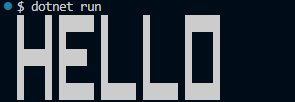

# Secret Message Decoder

A small C# console application that reads a text file of coordinate-based block characters and reconstructs the hidden message in the terminal.

## What it does

The program reads lines formatted like this:

```text
x symbol y
```

For example:

```text
0 █ 4
1 █ 4
2 █ 4
3 █ 4
4 █ 4
0 █ 3
...
```

The decoder then:

- parses each coordinate entry
- builds a 2D character grid
- flips the Y-axis so the output appears correctly on screen
- prints the decoded message to the terminal

## Prerequisites

- .NET SDK

## Run it

From the project folder:

```bash
dotnet run
```

## Demo



## File structure

- `Program.cs` – starts the decoder using the sample file
- `SecretMessageDecoder.cs` – parses the coordinates and renders the grid
- `hello.txt` – sample encoded message
- `README.md` – project overview and usage instructions

## Notes

This project is a simple interview-style coding exercise designed to demonstrate:

- coordinate parsing
- 2D grid reconstruction
- terminal rendering
- Unicode output handling in Windows terminals

## License

This project is licensed under the MIT License. See [LICENSE](LICENSE) for details.
